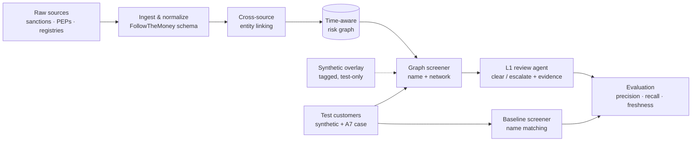

# From Names to Networks

**A prototype risk-intelligence platform for network-based sanctions and financial crime screening, grounded in current enforcement cases.**

> **Status:** 🚧 In development: Foundation phase
> **Last updated:** 22 September 2026
>
> This is an independent research and portfolio project. It is not affiliated with, endorsed by, or built on the proprietary data of any company. Nothing in this repository is legal advice or a legal determination under any sanctions regime.

---

## Overview

Most sanctions screening still works like a spell-checker: it compares a customer's name against a list and raises an alert when the strings look similar. This approach has two well-known failures:

1. **Too many false alarms.** Common names, transliterations, and partial matches generate large volumes of alerts that analysts must clear by hand. Industry sources commonly cite false-positive rates above 90% for traditional screening.
2. **Blind spots.** Risk that arrives *through relationships* is invisible to name matching. A company can have a clean name while being owned or controlled by a sanctioned person, or be one of many shell companies run on behalf of a sanctioned network.

**From Names to Networks** tests a different approach: build a connected, time-aware graph of people, companies, ownership, and sanctions designations, and screen customers against the *network* rather than a list of names.

---

## Why Now

Recent enforcement shows that the gap between name screening and ownership-aware screening is a live, costly problem.

**The A7 network alert (31 August 2026).** The UK National Crime Agency and National Economic Crime Centre issued Flash Alert 0808-NECC on A7, a sanctions evasion network sanctioned by the UK, EU, and US and linked to the sanctioned Russian state-backed bank Promsvyazbank. According to the alert, A7 moves value through shell companies ("sub-agents") that are registered abroad but controlled from inside Russia, hold ordinary local bank accounts, and pay suppliers using false invoices. OFSI identified transactions between A7 shell companies and UK-incorporated beneficiaries. Several of the alert's red flags describe the *customer* rather than the transaction, which is exactly the kind of risk that name screening misses and ownership analysis can surface.

**Enforcement against ownership-blind screening (2 September 2026).** OFSI announced a £4.7 million settlement with Citibank N.A., London Branch, after the bank processed payments involving designated persons, entities owned or controlled by designated persons, and designated Russian banks. OFSI cited weaknesses in sanctions screening.

**Higher penalties.** The UK announced that OFSI's maximum penalty for sanctions breaches will rise from the greater of £1 million or 50% of the breach value to the greater of £1 million or 100%.

**Fast-moving, converging lists.** In September 2026 alone, the US designated dozens of entities across Iran, the UAE, the UK, Turkey, Malaysia, and Kazakhstan under its Iran campaign, and sanctioned Russia's VTB Bank for helping Iran evade sanctions. Lists change weekly, and risk increasingly crosses sanctions programs. A static, single-program screener falls behind.

**UK register reform deadline (18 November 2026).** Under the Economic Crime and Corporate Transparency Act 2023, new directors and persons with significant control (PSCs) have had to verify their identity with Companies House since 18 November 2025. Existing directors and PSCs must complete verification by 18 November 2026. This is changing the quality of the UK's main open ownership dataset in real time.

---

## Objective

Build a working prototype that answers one question with evidence:

> **Does network-based screening reduce false positives and catch indirect risk that name matching misses, and by how much?**

Concretely, the project will:

- Build a **time-aware risk-intelligence graph** spanning multiple sanctions programs, from open sanctions, PEP, and corporate ownership data.
- **Link records across sources** so each real-world person or company has one profile.
- Implement **two screeners**, a name-matching baseline and a graph-aware screener, and compare them fairly on the same test sets.
- Test both on a **synthetic benchmark** and a **real-world case study of the A7 network**.
- Add an **L1 review agent** that recommends *clear* or *escalate* on remaining alerts, with cited evidence.
- Measure **data freshness**: how quickly a new designation reaches the graph and the customers linked to it.

---

## Purpose

### Why this matters

Industry research (e.g. McKinsey, *How agentic AI can change the way banks fight financial crime*, 2025) describes a progression from **analytical AI** (scoring and matching) to **generative AI** (summaries and drafts) to **agentic AI** (autonomous multi-step workflows with human oversight). Every stage depends on the same foundation: **the quality, structure, and freshness of the underlying risk data.** An AI agent clearing alerts is only as good as the data it checks against.

### What this project demonstrates

- That **structured, linked data** does much of the work often attributed to the AI model.
- That **network relationships** surface risk that name matching cannot see, as current cases like A7 show.
- That **freshness** is a measurable property of a screening system, not an afterthought.
- That a **narrow, explainable agent** can support routine alert review when it sits on top of good data.

---

## How It Works



### 1. Ingest and normalize
Raw data from each source is converted into the **FollowTheMoney (FtM)** schema, the open data model used by OpenSanctions. FtM provides standard entity types (`Person`, `Company`, `Ownership`, `Directorship`, `Sanction`) so new sources can be added without redesigning the graph. Every ingest records the **source snapshot date**.

### 2. Cross-source entity linking
OpenSanctions already deduplicates entities across the lists it consolidates. This project's resolution work is **linking across sources**: matching OpenSanctions entities to Companies House officers and PSCs, and to GLEIF legal entities, using names, dates of birth, nationalities, registration numbers, and addresses. Probabilistic record linkage (Splink) scores each candidate link; low-confidence links are kept but flagged.

### 3. The time-aware risk graph
Resolved entities become **nodes**; ownership, directorship, family, and sanction relationships become **edges**. Every edge and designation carries **start and end dates**, so the graph can be queried *as of any date*. This supports audit replay, freshness measurement, before/after register snapshots, and the future Sanctions Contagion module. The graph spans **multiple sanctions programs** so cross-program links (e.g. Russia–Iran) are visible.

### 4. Screening: baseline vs. graph

| | Baseline screener | Graph screener |
|---|---|---|
| **Input** | Customer name | Customer name + identifiers |
| **Method** | Fuzzy string match against list | Resolve customer to graph, then traverse relationships |
| **Catches** | Direct name hits | Direct hits **and** indirect exposure (ownership, control, sanctioned directors, multi-hop chains) |
| **Output** | Match score | Match score + risk path + evidence |

**Ownership test (simplified).** The graph screener applies a simplified ownership test modelled on the US **OFAC 50 Percent Rule**, under which entities owned 50% or more, individually or in aggregate, by blocked persons are themselves treated as blocked. This is a demonstration rule, not a legal determination. Other regimes differ; for example, the UK uses its own "ownership or control" test.

**Working with ownership bands.** UK PSC data reports ownership in **bands** (more than 25% up to 50%; more than 50% up to 75%; 75% or more), not exact percentages. So:

- A single designated owner in the top two bands is flagged as **crossing the threshold**.
- An owner in the lowest band, or several designated owners whose combined stake *might* reach 50%, is flagged as **ambiguous** and routed to review rather than decided automatically.

The screener is a **callable component** (`screen(entity, as_of_date) → hits + explanation`) so later modules can call it directly.

### 5. L1 review agent
For alerts the graph screener still raises, an LLM-based agent reviews the evidence and recommends **clear** or **escalate**, with an explanation citing specific graph facts (e.g. *"Date of birth mismatch: customer 1985, listed person 1962; no shared ownership links"*). Every decision is logged for audit. The agent recommends; it does not decide.

### 6. Evaluation

**a. Synthetic benchmark.** Evaluation runs on the real graph **plus a separate synthetic overlay**, combined only at test time and always tagged. The synthetic set includes:

- **True direct hits:** designated entities, including spelling and transliteration variants.
- **True indirect hits:** clean-named companies linked to designated entities through synthetic ownership or control edges.
- **Decoys:** innocent entities with names similar to listed persons.
- **Clean controls:** ordinary customers with no risk.

**b. Real-world case study: the A7 network.** Using entities already designated in connection with A7, the project maps their known links into UK and international company data and compares what each screener surfaces. The customer-level red flags from the original NCA Flash Alert are translated into graph checks where the data allows. (Red flags are taken from the alert's own text, not from secondary summaries.)

**c. Fair comparison.** The baseline is not set up to lose. Both screeners are compared across the full range of match thresholds using **precision–recall curves**, and headline numbers are reported **at equal recall**.

---

## Metrics

| Metric | What it tells us |
|---|---|
| **Precision** | Of the alerts raised, how many were real risk |
| **Recall** | Of the real risks, how many were caught |
| **False-positive rate** | How much wasted analyst effort each approach creates |
| **Alerts per 1,000 customers** | Operational workload |
| **Indirect-risk recall** | Share of network-only risks caught (baseline expected ≈ 0) |
| **Ambiguous-case rate** | Share of ownership cases the data cannot decide (a measure of data gaps) |
| **Designation-to-detection time** | How long a new designation takes to reach linked customers (freshness) |
| **Agent agreement rate** | How often the L1 agent's recommendation matches ground truth |

---

## Results

> *To be added as the pipeline is completed.* Planned outputs: precision–recall curves for both screeners, headline metrics at equal recall, the A7 case-study findings, and freshness measurements.

---

## Data Sources

| Source | Content | License / terms |
|---|---|---|
| [OpenSanctions](https://www.opensanctions.org) | Consolidated sanctions lists (incl. OFAC, UK, EU), PEPs, and related entities in FtM format | Free for non-commercial use; commercial use requires a license |
| [UK Companies House](https://find-and-update.company-information.service.gov.uk) | Company officers and PSC (beneficial ownership) register | Open Government Licence |
| [GLEIF](https://www.gleif.org) | Legal Entity Identifiers and parent–child relationships | Open data (CC0) |

Official lists (e.g. the OFAC SDN list and the UK Sanctions List) are used to **spot-check** OpenSanctions data for key case-study entities.

> Check each source's current terms before use. This project is intended for non-commercial research and demonstration.

---

## Tech Stack

| Layer | Tools |
|---|---|
| Language | Python 3.11+ |
| Data processing | `pandas` / `polars` |
| Data model | `followthemoney` |
| Entity linking | `splink` |
| Fuzzy matching (baseline) | `rapidfuzz` |
| Graph | `networkx` (prototype), Neo4j (optional, at scale) |
| L1 agent | LLM API (e.g. Anthropic Claude) |
| Evaluation & visuals | `scikit-learn`, `matplotlib` / `plotly` |
| Config & secrets | `pyyaml`, `python-dotenv` |
| Notebooks | Jupyter |

---

## Repository Structure

```
names-to-networks/
├── README.md
├── requirements.txt
├── .env.example               # template for API keys (real .env is git-ignored)
├── .gitignore
├── config/
│   └── settings.yaml          # paths, thresholds, snapshot dates, seeds
├── data/
│   ├── raw/                   # downloaded source files (git-ignored)
│   ├── processed/             # normalized FtM entities
│   ├── snapshots/             # dated register snapshots (e.g. pre/post 18 Nov 2026)
│   └── synthetic/             # synthetic overlay (tagged, test-only)
├── src/
│   ├── ingest/                # source downloaders and FtM converters
│   ├── resolve/               # cross-source entity linking
│   ├── graph/                 # graph build and as-of-date queries
│   ├── screen/                # baseline and graph screeners
│   ├── agent/                 # L1 review agent and audit log
│   └── evaluate/              # test sets, metrics, freshness
├── case_studies/
│   └── a7/                    # A7 network case study
├── notebooks/                 # exploration and results walkthroughs
├── modules/
│   ├── evasion_arena/         # future Module A
│   └── sanctions_contagion/   # future Module B
├── tests/
└── docs/
    ├── context_log.md         # dated log of relevant news and regulatory changes
    └── results/               # write-ups and charts
```

---

## Getting Started

> Setup instructions will be finalized as the pipeline is built.

```bash
git clone <your-repo-url>
cd names-to-networks
python -m venv .venv
source .venv/bin/activate        # Windows: .venv\Scripts\activate
pip install -r requirements.txt
cp .env.example .env             # then add your API keys to .env
```

Planned pipeline commands:

```bash
python -m src.ingest.run          # download and normalize sources
python -m src.resolve.run         # link entities across sources
python -m src.graph.build         # build the time-aware risk graph
python -m src.evaluate.run        # run both screeners, report metrics
```

---

## Reproducibility

- Every source download records its **snapshot date** in `config/settings.yaml` and in the processed data.
- Synthetic data generation uses **fixed random seeds**.
- Results write-ups state the snapshot dates they were produced from.
- `docs/context_log.md` records the real-world events the project responds to, with dates and sources, so readers can see what was known when.

---

## Design Principles

1. **Time-aware from day one.** Every relationship and designation has dates, so the graph can answer "what did we know on date X?"
2. **Standard schema.** FollowTheMoney keeps the data interoperable and extensible.
3. **Cross-program by default.** One graph spans sanctions programs, because current risk crosses them.
4. **Screening as a service.** The screener is a callable component, not a script.
5. **Synthetic data is quarantined.** Synthetic entities live in a tagged overlay, combined with real data only at test time.
6. **Uncertainty is surfaced, not hidden.** Ambiguous ownership and low-confidence links are flagged for review, not silently decided.
7. **Explainability over black boxes.** Every alert and agent recommendation comes with a traceable evidence path.

---

## Roadmap

- [ ] **Foundation: From Names to Networks**
  - [ ] Ingest and normalize sources to FtM (with snapshot dates)
  - [ ] Cross-source entity linking
  - [ ] Time-aware, cross-program graph
  - [ ] Baseline and graph screeners (with band-aware ownership test)
  - [ ] Synthetic overlay and benchmark
  - [ ] A7 case study
  - [ ] Freshness measurement
  - [ ] L1 review agent
  - [ ] Results write-up
- [ ] **Timely analysis: UK register verification deadline.** Take a Companies House snapshot **before 18 November 2026** and another after it, then study what happens to companies whose directors or PSCs do not verify (dissolution, officer changes, inactivity).
- [ ] **Module A: Evasion Arena.** AI "launderer" agents generate synthetic evasion structures (shell layering, nominees, transliteration, A7-style sub-agents) to stress-test the screener; successful evasions become new detection rules.
- [ ] **Module B: Sanctions Contagion.** Link prediction on the historical graph to test whether entities close to designated parties are designated later, and how far in advance they could have been flagged.

---

## Limitations and Ethics

- **Prototype, not production.** Results come from open data, a synthetic benchmark, and one case study; they do not represent real-world screening performance.
- **Not legal determinations.** Ownership tests are simplified for demonstration and do not reflect the full rules of any sanctions regime.
- **Exposure, not accusation.** The project reports links to *already-designated* parties. It does not accuse any unlisted company or person of wrongdoing. The NCA itself notes that a Flash Alert is not a statement that the described activity is definitively illicit.
- **Open data is incomplete.** Ownership coverage varies widely by jurisdiction. Networks like A7 rely on companies registered in places with little public ownership data, so the graph will miss much of the real structure. The ambiguous-case rate makes these gaps visible.
- **Real people are in the data.** Sanctions and PEP records concern real individuals. Data is used only for research.
- **Privacy and external APIs.** The L1 agent runs on **synthetic customers**, and sends only the minimum fields needed about listed entities to an external LLM API. API keys are stored in `.env` and never committed.
- **False positives have human costs.** Wrongful matches can lead to account closures and financial exclusion. Reducing them is a fairness goal as well as an efficiency one.
- **Agent recommendations require oversight.** In any real deployment, humans would remain accountable for dispositions.

---

## References

- McKinsey & Company, *How agentic AI can change the way banks fight financial crime* (August 2025). https://www.mckinsey.com/capabilities/risk-and-resilience/our-insights/how-agentic-ai-can-change-the-way-banks-fight-financial-crime
- National Crime Agency / NECC, *Flash Alert 0808-NECC: A7 Sanctions Evasion Mechanism* (31 August 2026). https://www.nationalcrimeagency.gov.uk/who-we-are/publications/826-necc-a7-sanctions-evasion-mechanism/file
- Fieldfisher, *UK, EU and US sanctions on Russia* (OFSI–Citibank settlement; OFSI penalty increase), September 2026. https://www.fieldfisher.com/en/services/international-trade/trade-sanctions-blog/uk-eu-and-us-sanctions-on-russia
- U.S. Department of State, *U.S. Sanctions VTB Bank for Aiding Iran's Sanctions Evasion* (14 September 2026). https://www.state.gov/releases/office-of-the-spokesman/2026/09/u-s-sanctions-vtb-bank-for-aiding-irans-sanctions-evasion/
- STEP, *Companies House releases guidance on PSC identity verification*. https://www.step.org/industry-news/companies-house-releases-guidance-psc-identity-verification
- OFAC, *Revised Guidance on Entity Property and Interests Blocked* (the 50 Percent Rule), via https://ofac.treasury.gov
- OpenSanctions. https://www.opensanctions.org
- FollowTheMoney data model documentation (OpenSanctions / FtM project).

---

## License

TBD. Code license to be chosen; data remains subject to each source's own terms.

## Author

*Your name · contact · LinkedIn*
